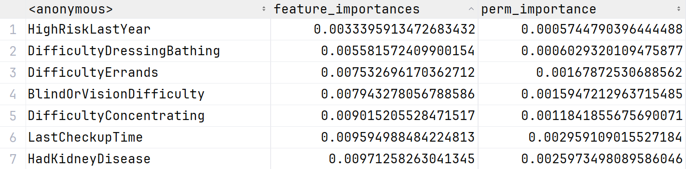

# 数据挖掘课程设计

本课程设计基于二十多万条调查问卷数据，尝试进行心脏病的「风险预测」任务和「预防分析」任务。

- 数据集见 [Heart Disease Dataset](./dataset/Heart%20Disease%20Dataset.csv)；
- 属性描述见 [Codebook2022](./dataset/Codebook2022.HTML)。

## 任务一、心脏病风险预测

### 数据预处理

#### 数据编码

观察数据表，数据类型主要分为以下三类：

1. 数值型
2. 具有序关系的文本类型（包括二值型）
3. 不具备序关系的文本类型（仅两个：State, RaceEthnicityCategory）

数值型不特别处理。具有序关系的文本则使用自然数编码。[顺序编码文档](asserts/map.txt)。

对于 State 字段，考虑到模型需要在更大的范围中应用，地域不宜作为模型的特征之一。

对于 RaceEthnicityCategory 字段，采用二进制编码表示其人种。

```python
for col in df.columns:
    if col in text2number:
        df[col] = df[col].apply(lambda x: text2number[col][x])
    elif col == 'RaceEthnicityCategory':
        df[col] = df[col].apply(lambda x: RaceEthnicityCategory_dict[x])
    elif len(df[col].unique()) == 2:
        df[col] = df[col].apply(lambda x: 1 if x == 'Yes' else 0)

```

为了避免数据范围对模型参数的影响，我们采取 Min-Max 归一化。

#### 数据划分

考虑到类别不平衡的问题，我们按照是否患有心脏病分离数据。

```python
common = normalized[normalized['HadHeartAttack'] == 0]
rare = normalized[normalized['HadHeartAttack'] == 1]
```

然后将两类分别按照 train : val : test = 6 : 2 : 2 的比例划分数据集。

```python
def split_data(data, train_size=0.6, val_size=0.2, test_size=0.2):
    train_val, test = train_test_split(data, test_size=test_size, random_state=random_state)
    train, val = train_test_split(train_val, test_size=val_size / (train_size + val_size), random_state=random_state)
    return train, val, test
```

最后再将两部分合并。

```python
train = pd.concat([train_common, train_rare])
val = pd.concat([val_common, val_rare])
test = pd.concat([test_common, test_rare])
```

#### 特征选择

训练一个随机森林分类器，利用 ``feature_importances_`` 属性发现一些与心脏病相关性低的特征：

```
HighRiskLastYear
DifficultyDressingBathing
DifficultyErrands
BlindOrVisionDifficulty 
DifficultyConcentrating
LastCheckupTime 
HadKidneyDisease
```

接着使用 ``permutation_importance`` 方法确认重要性低的特征，并考虑到实际意义舍弃以下特征：

|       特征       |                理由                |
| :--------------: | :--------------------------------: |
| HighRiskLastYear |                                    |
| LastCheckupTime  | 多年不做检查与心脏病没有直接的关联 |
| HadKidneyDisease |                                    |

另外观察到，BMI 指标是可以由身高和体重直接确定的，该字段存在冗余故舍弃。

两种方法得到的重要性指标值详见  [feature_importance.csv](asserts/feature_importance.csv)  .

部分重要性指标值



特征重要性条形图


### 模型横向对比

#### 调研报告与分析

##### 一、传统机器学习模型

1. **XGBoost/LightGBM**

**理由：**

- **处理不平衡能力**：支持`scale_pos_weight`参数直接调整正负样本权重（官方文档建议设置为sum(negative)/sum(positive)）
- **特征兼容性**：原生支持混合类型特征（数值型+类别型），无需完整独热编码
- **高效性**：基于直方图的决策树分裂策略，适合大数据量场景
- **可解释性**：提供特征重要性排序（`feature_importances_`）

**实现方案：**

```python
from lightgbm import LGBMClassifier

model = LGBMClassifier(
    scale_pos_weight=19,  # 负样本数/正样本数≈19:1
    objective='binary',
    metric='auc',
    n_estimators=1000,
    learning_rate=0.05,
    max_depth=6,
    subsample=0.8,
    colsample_bytree=0.7
)
```

**官方文档：**

- [LightGBM不平衡分类指南](https://lightgbm.readthedocs.io/en/latest/Parameters.html#scale_pos_weight)

2. **随机森林 + SMOTE**

**理由：**

- **鲁棒性**：对噪声数据和缺失值不敏感
- **组合优化**：通过SMOTE过采样解决类别不平衡问题

**实现方案：**

```python
from imblearn.pipeline import Pipeline
from sklearn.ensemble import RandomForestClassifier
from imblearn.over_sampling import SMOTE

pipeline = Pipeline([
    ('smote', SMOTE(sampling_strategy=0.3)),  # 调整正样本比例至30%
    ('rf', RandomForestClassifier(
        class_weight='balanced',
        n_estimators=500,
        max_depth=10,
        max_features='sqrt'
    ))
])
```

**官方文档：**

- [Scikit-learn类权重设置](https://scikit-learn.org/stable/modules/generated/sklearn.ensemble.RandomForestClassifier.html)
- [SMOTE算法实现](https://imbalanced-learn.org/stable/references/generated/imblearn.over_sampling.SMOTE.html)

##### 二、深度学习模型

1. **深度残差网络（ResNet变体）**

**理由：**

- **特征交互**：通过残差连接捕捉高阶特征交叉（如BMI与Age的复合影响）
- **正则化能力**：BatchNorm+Dropout防止过拟合
- **类别平衡**：自定义Focal Loss缓解样本不均衡

**实现方案：**

```python
import tensorflow as tf
from tensorflow.keras.layers import Dense, BatchNormalization, Dropout, Input, Add

def residual_block(x, units):
    shortcut = x
    x = Dense(units)(x)
    x = BatchNormalization()(x)
    x = tf.keras.activations.relu(x)
    x = Dropout(0.3)(x)
    x = Dense(units)(x)
    return Add()([shortcut, x])

inputs = Input(shape=(n_features,))
x = Dense(128)(inputs)
x = residual_block(x, 128)
x = Dense(64)(x)
outputs = Dense(1, activation='sigmoid')(x)

model = tf.keras.Model(inputs=inputs, outputs=outputs)
model.compile(
    optimizer=tf.keras.optimizers.Adam(0.001),
    loss=tf.keras.losses.BinaryFocalCrossentropy(gamma=2.0),  # 聚焦困难样本
    metrics=[tf.keras.metrics.AUC(name='auc')]
)
```

**官方文档：**

- [Focal Loss实现](https://www.tensorflow.org/addons/api_docs/python/tfa/losses/sigmoid_focal_crossentropy)

2. **Wide & Deep 架构**

**理由：**

- **双路学习**：Wide部分记忆高频特征组合，Deep部分泛化潜在模式
- **医疗数据适配**：适合既有明确风险因子（如AgeCategory）又需挖掘隐含关联的场景

**实现方案：**

```python
wide_input = tf.keras.layers.Concatenate()([
    Input(shape=(1,)),  # 例如AgeCategory
    Input(shape=(1,))   # 例如BMI
])

deep_input = Input(shape=(n_features,))
x = Dense(256, activation='relu')(deep_input)
x = Dense(128, activation='relu')(x)

merged = tf.keras.layers.Concatenate()([wide_input, x])
outputs = Dense(1, activation='sigmoid')(merged)

model = tf.keras.Model(inputs=[wide_input, deep_input], outputs=outputs)
```

##### 三、模型选择建议矩阵


| 考量维度       | XGBoost/LightGBM       | 随机森林+SMOTE     | 深度残差网络         | Wide & Deep        |
| -------------- | ---------------------- | ------------------ | -------------------- | ------------------ |
| 训练速度       | ⭐⭐⭐⭐⭐（最快）     | ⭐⭐⭐⭐           | ⭐⭐                 | ⭐⭐               |
| 可解释性       | ⭐⭐⭐⭐（特征重要性） | ⭐⭐⭐⭐           | ⭐                   | ⭐⭐               |
| 处理不平衡能力 | ⭐⭐⭐⭐（内置权重）   | ⭐⭐⭐（依赖采样） | ⭐⭐⭐（Focal Loss） | ⭐⭐⭐             |
| 特征工程需求   | ⭐⭐（需基本编码）     | ⭐⭐（需编码）     | ⭐⭐⭐（自动学习）   | ⭐⭐⭐（部分自动） |

##### 四、性能优化建议

- 树模型调参重点：限制最大深度、增大min_child_weight
- 深度学习优化：使用学习率预热、SWA提升泛化性

建议优先尝试LightGBM/XGBoost方案，在获得基线性能后，再通过深度学习模型探索非线性关系的潜在价值。实际部署时建议采用模型集成策略。

#### 实验结果与分析

##### LightGBM

准确率为：0.9493

```python
# 训练
gbm = lgb.LGBMClassifier(random_state=42)
gbm.fit(X_train, y_train, eval_set=[(X_valid, y_valid)], eval_metric="l1", callbacks=[lgb.early_stopping(5)])

# 测试
y_pred = gbm.predict(X_test, num_iteration=gbm.best_iteration_)
acc = accuracy_score(y_test, y_pred)
print(f"准确率：{acc}")
```

##### 随机森林

准确率为：0.9482

```python
# 训练
rf = RandomForestClassifier(random_state=42)
rf.fit(X_train, y_train)

# 测试
y_pred = rf.predict(X_test)
acc = accuracy_score(y_test, y_pred)
print("rf 的准确率为：%f" % acc)
```

##### FNN

准确率为：0.9493

```python
class MLP(nn.Module):
    def __init__(self, input_dim):
        super(MLP, self).__init__()
        self.fc1 = nn.Linear(input_dim, 64)
        self.fc2 = nn.Linear(64, 32)
        self.fc3 = nn.Linear(32, 1)
        self.sigmoid = nn.Sigmoid()

    def forward(self, x):
        x = torch.relu(self.fc1(x))
        x = torch.relu(self.fc2(x))
        x = self.fc3(x)
        return self.sigmoid(x)
```

##### TabNet

准确率为：0.9457

```python
model = TabNetClassifier(
    n_d=8,
    n_a=8,
    n_steps=3,
    gamma=1.5,
    lambda_sparse=0.001,
    optimizer_fn=torch.optim.Adam,
    optimizer_params=dict(lr=2e-2),
    mask_type="sparsemax"
)
```

### 模型纵向调优

dwj：给出实验结果与分析

## 任务二、心脏病预防分析

### 相关性分析

本节分二值型数据、整数型或多分类型数据 以及 连续型数据三部分。

#### 二值形数据

```python
'Sex', 'PhysicalActivities', 'HadHeartAttack', 'HadAngina', 'HadStroke', 
'HadAsthma', 'HadSkinCancer', 'HadCOPD', 'HadDepressiveDisorder', 'HadKidneyDisease',
'HadArthritis', 'DeafOrHardOfHearing', 'BlindOrVisionDifficulty', 'DifficultyConcentrating', 
'DifficultyWalking', 'DifficultyDressingBathing', 'DifficultyErrands', 'ChestScan', 
'AlcoholDrinkers', 'HIVTesting', 'FluVaxLast12', 'PneumoVaxEver', 'HighRiskLastYear'
```

对于任意一个属性 $X$, 考察关联规则 $X \rightarrow HadHeartAttack$ 的置信度与提升度。

| Column                    | Confidence           | Lift               |
| :------------------------ | :------------------- | :----------------- |
| HadAngina                 | 0.5040565686639374   | 8.29325253366142   |
| HadStroke                 | 0.18742091551916637  | 4.559896012446236  |
| HadKidneyDisease          | 0.1410494975809453   | 3.07526404589324   |
| HadCOPD                   | 0.2251581689616673   | 2.916387440470007  |
| DifficultyDressingBathing | 0.09646445850390771  | 2.845608994010597  |
| DifficultyWalking         | 0.3819129140305173   | 2.604906541048404  |
| DifficultyErrands         | 0.15943431336062525  | 2.394064248145004  |
| DeafOrHardOfHearing       | 0.19910681056940827  | 2.329053620668836  |
| BlindOrVisionDifficulty   | 0.11566803126163007  | 2.3275707825166654 |
| ChestScan                 | 0.768440640119092    | 1.81433112440863   |
| HadArthritis              | 0.5779679940454038   | 1.675162775008404  |
| HadSkinCancer             | 0.14291030889467807  | 1.6725693361346508 |
| DifficultyConcentrating   | 0.1729065872720506   | 1.6223807938155774 |
| PneumoVaxEver             | 0.651135094901377    | 1.6036675441259218 |
| HadAsthma                 | 0.18362486043915147  | 1.236709338195979  |
| HadDepressiveDisorder     | 0.24562709341272795  | 1.1937903748634167 |
| FluVaxLast12              | 0.6271678451804987   | 1.176080731173181  |
| HIVTesting                | 0.31470040937848903  | 0.9162294870667512 |
| PhysicalActivities        | 0.6337179010048382   | 0.8149183319970535 |
| AlcoholDrinkers           | 0.39642724227763304  | 0.7208039717060304 |
| Sex                       | 0.3671008559732043   | 0.7066284340803191 |
| HighRiskLastYear          | 0.025158168961667286 | 0.585236672114912  |

如果你希望自己操作表格来了解评价指标的排序，或者使用其他表格的功能，你可以参考表格： [binary_classification_correlation.csv](asserts\binary_classification_correlation.csv) 

**分析结果：**

- **HadAngina**：具有较高的置信度（0.504）和提升度（8.29），表明患有心绞痛的人群中有较高比例患有心脏病。这可能是因为心绞痛是心脏病的早期症状或并发症。
- **HadStroke**：较低的置信度（0.187）和提升度（4.56）表明中风和心脏病之间有一定的关联，尽管相关性相较于心绞痛较弱。
- **ChestScan**：具有较高的置信度（0.768）和较低的提升度（1.81），表明通过胸部扫描检测到的健康问题与心脏病相关，但提升度较低可能表明胸部扫描结果对于预测心脏病的提升效能不如其他指标。
- **PhysicalActivities** 和 **Sex**：这两个特征显示出较低的提升度（<1.0），表明这些变量对心脏病的预测贡献相对较小。

这些结果揭示了具有直接关系的因素，如心绞痛和心脏病，而一些生活习惯（如锻炼、性别）则对预测心脏病的贡献较小。

#### 整数型或多分类型数据

```python
'GeneralHealth', 'PhysicalHealthDays', 'MentalHealthDays', 'LastCheckupTime', 'SleepHours', 
'RemovedTeeth', 'HadDiabetes', 'SmokerStatus', 'ECigaretteUsage', 'RaceEthnicityCategory', 
'AgeCategory', 'TetanusLast10Tdap', 'CovidPos'
```

这部分数据采用 **卡方检验** 和 **Cramér's V** 分析其与心脏病之间的相关性。

| Column                | Chi2 Statistic     | P-value                 | Cramér's V           |
| :-------------------- | :----------------- | :---------------------- | :------------------- |
| GeneralHealth         | 9893.915405890815  | 0.0                     | 0.2005382053427175   |
| PhysicalHealthDays    | 4504.004562288446  | 0.0                     | 0.1353045616190594   |
| MentalHealthDays      | 652.1276988304685  | 4.540413350732394e-118  | 0.051484838074468145 |
| LastCheckupTime       | 1240.5932733282991 | 1.1420838066709514e-268 | 0.07101134501949781  |
| SleepHours            | 1674.2009084354595 | 0.0                     | 0.08249294615175332  |
| RemovedTeeth          | 6996.868972027133  | 0.0                     | 0.16864167154362364  |
| HadDiabetes           | 5345.73706749969   | 0.0                     | 0.14740656453876474  |
| SmokerStatus          | 2241.3421716655416 | 0.0                     | 0.09544806071432936  |
| ECigaretteUsage       | 114.24995520794386 | 1.3352362106950711e-24  | 0.021549690983575755 |
| RaceEthnicityCategory | 195.91695159437063 | 2.8354859723996284e-41  | 0.028219481834577224 |
| AgeCategory           | 7925.092831877682  | 0.0                     | 0.17947964700061586  |
| TetanusLast10Tdap     | 412.31579538386654 | 4.7573727372082324e-89  | 0.04093813123566741  |
| CovidPos              | 210.97187201981063 | 1.541842712734372e-46   | 0.029283656635577554 |

如果你希望自己操作表格来了解评价指标的排序，或者使用其他表格的功能，你可以参考表格：  [natural_numbers_correlation.csv](asserts\natural_numbers_correlation.csv) 

**分析结果：**

- **GeneralHealth**：具有极高的卡方值（9893.92）和显著的低 p 值（0.0），Cramér's V 值为0.20，表明健康状况与心脏病的关系显著。更差的健康状况通常伴随更高的心脏病风险。
- **PhysicalHealthDays**：卡方值也很高（4504.00），且具有显著的关系（p值为0.0）。这表明身体健康状态对心脏病的预测具有较高的价值。
- **SmokerStatus** 和 **HadDiabetes**：这些变量也显示出显著的统计相关性，表明吸烟和糖尿病与心脏病之间的联系。
- **CovidPos**：卡方值较低，p值也较高，Cramér's V 值为0.03，表明 COVID-19 与心脏病之间的相关性较弱。

通过分析这些整数型或多分类型数据，我们可以发现身体健康状况、吸烟状况和糖尿病与心脏病有显著的相关性。特别是一般健康状况的差与心脏病风险呈现明显正相关。

####  连续型数据

```python
'HeightInMeters', 'WeightInKilograms', 'BMI'
```

尽管这里的三个属性可以通过常识判断，我们还是使用点双列相关系数分析一下。

| Column            | Point-Biserial Correlation | P-value                |
| :---------------- | :------------------------- | :--------------------- |
| HeightInMeters    | 0.023058562103926115       | 2.680270217356652e-30  |
| WeightInKilograms | 0.03843558794581402        | 4.378522592945912e-81  |
| BMI               | 0.03041348110560678        | 1.9223816884591188e-51 |

如果你希望自己操作表格来了解评价指标的排序，或者使用其他表格的功能，你可以参考表格：  [real_numbers_correlation.csv](asserts\real_numbers_correlation.csv) 

**分析结果：**

- **HeightInMeters**、**WeightInKilograms** 和 **BMI** 都表现出一定的相关性。

这说明 $BMI$ 与心脏健康存在密切联系。

**心脏病预防策略**

1. **Teeth (牙齿健康)**  
研究显示，牙齿健康和心脏健康之间可能存在一定的关联。牙周病可能导致炎症，进一步增加心脏病的风险。  
**建议与策略:**
- 定期检查牙齿，保持口腔卫生。
- 每天刷牙2次，使用牙线清洁牙齿间隙，预防牙龈炎和牙周病。
- 如果有牙齿感染或问题，应尽早治疗，避免炎症扩展至身体其他部位。

**参考论文:**  
[https://journals.plos.org/plosone/article?id=10.1371/journal.pone.0030797#s3](https://journals.plos.org/plosone/article?id=10.1371/journal.pone.0030797#s3)

2. **BMI (体重指数)**  
体重过重或肥胖是心脏病的重要风险因素。  
**建议与策略:**
- 维持健康的体重，BMI应在18.5到24.9之间。
- 如果BMI超过25，应采取减少体重的措施，特别是通过改善饮食和增加运动。
- 关注腰围，尤其是腹部脂肪的减少，因为腹部肥胖与心脏病风险相关性更强。

**参考论文:**  
[https://www.sciencedirect.com/science/article/abs/pii/S0939475321001186](https://www.sciencedirect.com/science/article/abs/pii/S0939475321001186)

3. **Age (年龄)**  
年龄是心脏病的自然风险因素。随着年龄增长，心脏病的风险逐渐增加。  
**建议与策略:**
- 年长者应更加重视定期健康检查，包括心血管健康评估。
- 提前采取健康生活方式，降低中年期的心脏病风险。
- 维持良好的心血管健康，积极管理血压、血糖和胆固醇水平。

**参考论文:**  
[https://pmc.ncbi.nlm.nih.gov/articles/PMC3297980/](https://pmc.ncbi.nlm.nih.gov/articles/PMC3297980/)

4. **Sleep Hours (睡眠时间)**  
研究显示，睡眠时间不足或过多都可能增加心脏病风险。建议成人每晚睡眠7到8小时。  
**建议与策略:**
- 保证每晚7到8小时的高质量睡眠。
- 建立规律的作息时间，避免长期熬夜。
- 如果存在睡眠障碍，尽早寻求专业帮助，避免长期睡眠不足对心脏健康造成影响。

**参考论文:**  
[https://pubmed.ncbi.nlm.nih.gov/27336192/](https://pubmed.ncbi.nlm.nih.gov/27336192/)

5. **Smoker Status (吸烟状况)**  
吸烟是心脏病的主要风险因素之一。吸烟不仅增加血压，还加速动脉硬化。  
**建议与策略:**
- 尽早戒烟，吸烟者应寻求帮助戒烟。
- 如果不吸烟，避免接触二手烟。
- 参加戒烟课程或使用替代疗法，如尼古丁替代品，以帮助戒烟。

**参考论文:**  
[https://rs.yiigle.com/CN112338201801/1021481.htm](https://rs.yiigle.com/CN112338201801/1021481.htm)

6. **Mental Health (心理健康)**  
精神健康与心脏健康密切相关，长期的心理压力、焦虑或抑郁症状可能增加心脏病的风险。  
**建议与策略:**
- 采用放松技巧，如冥想、深呼吸等来缓解压力。
- 积极管理焦虑或抑郁，寻求心理健康专业帮助。
- 保持积极的社交活动，建立支持系统。

**参考论文:**  
[https://pmc.ncbi.nlm.nih.gov/articles/PMC2633295/](https://pmc.ncbi.nlm.nih.gov/articles/PMC2633295/)

7. **Physical Health (身体健康)**  
身体健康，包括定期运动、健康饮食等，对预防心脏病至关重要。  
**建议与策略:**
- 定期进行有氧运动，每周至少150分钟中等强度运动（如快走、骑车等）。
- 维持健康饮食，增加蔬菜、水果和全谷物的摄入，减少高脂肪和高糖分食物。
- 监测血糖、血脂和血压，确保这些指标维持在健康范围内。

**参考论文:**  
[https://pubmed.ncbi.nlm.nih.gov/26630458/](https://pubmed.ncbi.nlm.nih.gov/26630458/)

**综合建议：**  
结合上述各个因素，预防心脏病的策略应包括：
1. 保持健康体重、定期运动，并监控血脂、血糖、血压。
2. 改善口腔卫生，避免牙周病引发炎症。
3. 保证良好的睡眠质量，减轻心理压力。
4. 戒烟，并避免二手烟的暴露。
5. 维护心理健康，采取积极的心态管理。

通过综合调整生活方式，可以大大降低心脏病的风险，提升整体健康水平。


lhy：给出实验结果与分析

## 任务清单

- [x] lhy：数据预处理。将处理好的数据上传到 ./dataset/ 路径下，并在本文件对应部分写上数据处理时的详细步骤与可视化结果，给出特征选择的原因；
- [x] lsb：调研本场景适用的「二分类模型」。在本文对应位置写上详细的原因与出处，最好找官方的文档进行说明；
- [x] dwj：基于 lsb 调研结果给出实验结果。给出代码实现与结果分析说明。
- [x] dwj：完成消融实验。基于最佳模型给出其调优结果。
- [x] fhy：调研本场景适用的「预防分析策略」。与 lsb 的调研要求一致，在本文对应位置写上详细的原因与出处，最好找官方的文档进行说明；
- [x] lhy：基于 fhy 调研结果给出实验结果与分析。给出代码实现与结果分析说明。
