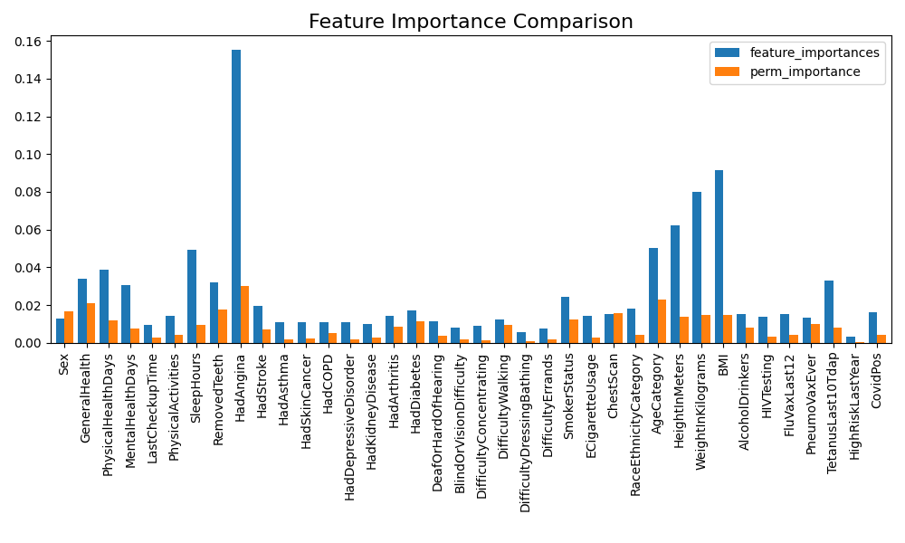

# 数据挖掘课程设计

本课程设计基于二十多万条调查问卷数据，尝试进行心脏病的「风险预测」任务和「预防分析」任务。

- 数据集见 [Heart Disease Dataset](./dataset/Heart%20Disease%20Dataset.csv)；
- 属性描述见 [Codebook2022](./dataset/Codebook2022.HTML)。

## 任务一、心脏病风险预测

### 数据预处理

#### 数据编码

观察数据表，数据类型主要分为以下三类：

1. 数值型
2. 具有序关系的文本类型（包括二值型）
3. 不具备序关系的文本类型（仅两个：State, RaceEthnicityCategory）

数值型不特别处理。具有序关系的文本则使用自然数编码。[顺序编码文档](constants/map.txt)。

对于 State 字段，考虑到模型需要在更大的范围中应用，地域不宜作为模型的特征之一。

对于 RaceEthnicityCategory 字段，采用二进制编码表示其人种。

```python
for col in df.columns:
    if col in text2number:
        df[col] = df[col].apply(lambda x: text2number[col][x])
    elif col == 'RaceEthnicityCategory':
        df[col] = df[col].apply(lambda x: RaceEthnicityCategory_dict[x])
    elif len(df[col].unique()) == 2:
        df[col] = df[col].apply(lambda x: 1 if x == 'Yes' else 0)

```

为了避免数据范围对模型参数的影响，我们采取 Min-Max 归一化。

#### 数据划分

考虑到类别不平衡的问题，我们按照是否患有心脏病分离数据。

```python
common = normalized[normalized['HadHeartAttack'] == 0]
rare = normalized[normalized['HadHeartAttack'] == 1]
```

然后将两类分别按照 train : val : test = 6 : 2 : 2 的比例划分数据集。

```python
def split_data(data, train_size=0.6, val_size=0.2, test_size=0.2):
    train_val, test = train_test_split(data, test_size=test_size, random_state=random_state)
    train, val = train_test_split(train_val, test_size=val_size / (train_size + val_size), random_state=random_state)
    return train, val, test
```

最后再将两部分合并。

```python
train = pd.concat([train_common, train_rare])
val = pd.concat([val_common, val_rare])
test = pd.concat([test_common, test_rare])
```

#### 特征选择

训练一个随机森林分类器，利用 ``feature_importances_`` 属性发现一些与心脏病相关性低的特征：

TODO

接着使用 ``permutation_importance`` 方法确认重要性低的特征，最终结果如下：

TODO

两种方法得到的重要性指标值详见  [feature_importance.csv](asserts\feature_importance.csv)  .

#### 特征重要性条形图



### 模型横向对比

#### 调研报告与分析

##### 一、传统机器学习模型

1. **XGBoost/LightGBM**

**理由：**

- **处理不平衡能力**：支持`scale_pos_weight`参数直接调整正负样本权重（官方文档建议设置为sum(negative)/sum(positive)）
- **特征兼容性**：原生支持混合类型特征（数值型+类别型），无需完整独热编码
- **高效性**：基于直方图的决策树分裂策略，适合大数据量场景
- **可解释性**：提供特征重要性排序（`feature_importances_`）

**实现方案：**

```python
from lightgbm import LGBMClassifier

model = LGBMClassifier(
    scale_pos_weight=19,  # 负样本数/正样本数≈19:1
    objective='binary',
    metric='auc',
    n_estimators=1000,
    learning_rate=0.05,
    max_depth=6,
    subsample=0.8,
    colsample_bytree=0.7
)
```

**官方文档：**

- [LightGBM不平衡分类指南](https://lightgbm.readthedocs.io/en/latest/Parameters.html#scale_pos_weight)

2. **随机森林 + SMOTE**

**理由：**

- **鲁棒性**：对噪声数据和缺失值不敏感
- **组合优化**：通过SMOTE过采样解决类别不平衡问题

**实现方案：**

```python
from imblearn.pipeline import Pipeline
from sklearn.ensemble import RandomForestClassifier
from imblearn.over_sampling import SMOTE

pipeline = Pipeline([
    ('smote', SMOTE(sampling_strategy=0.3)),  # 调整正样本比例至30%
    ('rf', RandomForestClassifier(
        class_weight='balanced',
        n_estimators=500,
        max_depth=10,
        max_features='sqrt'
    ))
])
```

**官方文档：**

- [Scikit-learn类权重设置](https://scikit-learn.org/stable/modules/generated/sklearn.ensemble.RandomForestClassifier.html)
- [SMOTE算法实现](https://imbalanced-learn.org/stable/references/generated/imblearn.over_sampling.SMOTE.html)

##### 二、深度学习模型

1. **深度残差网络（ResNet变体）**

**理由：**

- **特征交互**：通过残差连接捕捉高阶特征交叉（如BMI与Age的复合影响）
- **正则化能力**：BatchNorm+Dropout防止过拟合
- **类别平衡**：自定义Focal Loss缓解样本不均衡

**实现方案：**

```python
import tensorflow as tf
from tensorflow.keras.layers import Dense, BatchNormalization, Dropout, Input, Add

def residual_block(x, units):
    shortcut = x
    x = Dense(units)(x)
    x = BatchNormalization()(x)
    x = tf.keras.activations.relu(x)
    x = Dropout(0.3)(x)
    x = Dense(units)(x)
    return Add()([shortcut, x])

inputs = Input(shape=(n_features,))
x = Dense(128)(inputs)
x = residual_block(x, 128)
x = Dense(64)(x)
outputs = Dense(1, activation='sigmoid')(x)

model = tf.keras.Model(inputs=inputs, outputs=outputs)
model.compile(
    optimizer=tf.keras.optimizers.Adam(0.001),
    loss=tf.keras.losses.BinaryFocalCrossentropy(gamma=2.0),  # 聚焦困难样本
    metrics=[tf.keras.metrics.AUC(name='auc')]
)
```

**官方文档：**

- [Focal Loss实现](https://www.tensorflow.org/addons/api_docs/python/tfa/losses/sigmoid_focal_crossentropy)

2. **Wide & Deep 架构**

**理由：**

- **双路学习**：Wide部分记忆高频特征组合，Deep部分泛化潜在模式
- **医疗数据适配**：适合既有明确风险因子（如AgeCategory）又需挖掘隐含关联的场景

**实现方案：**

```python
wide_input = tf.keras.layers.Concatenate()([
    Input(shape=(1,)),  # 例如AgeCategory
    Input(shape=(1,))   # 例如BMI
])

deep_input = Input(shape=(n_features,))
x = Dense(256, activation='relu')(deep_input)
x = Dense(128, activation='relu')(x)

merged = tf.keras.layers.Concatenate()([wide_input, x])
outputs = Dense(1, activation='sigmoid')(merged)

model = tf.keras.Model(inputs=[wide_input, deep_input], outputs=outputs)
```

##### 三、模型选择建议矩阵


| 考量维度       | XGBoost/LightGBM       | 随机森林+SMOTE     | 深度残差网络         | Wide & Deep        |
| -------------- | ---------------------- | ------------------ | -------------------- | ------------------ |
| 训练速度       | ⭐⭐⭐⭐⭐（最快）     | ⭐⭐⭐⭐           | ⭐⭐                 | ⭐⭐               |
| 可解释性       | ⭐⭐⭐⭐（特征重要性） | ⭐⭐⭐⭐           | ⭐                   | ⭐⭐               |
| 处理不平衡能力 | ⭐⭐⭐⭐（内置权重）   | ⭐⭐⭐（依赖采样） | ⭐⭐⭐（Focal Loss） | ⭐⭐⭐             |
| 特征工程需求   | ⭐⭐（需基本编码）     | ⭐⭐（需编码）     | ⭐⭐⭐（自动学习）   | ⭐⭐⭐（部分自动） |

##### 四、性能优化建议

- 树模型调参重点：限制最大深度、增大min_child_weight
- 深度学习优化：使用学习率预热、SWA提升泛化性

建议优先尝试LightGBM/XGBoost方案，在获得基线性能后，再通过深度学习模型探索非线性关系的潜在价值。实际部署时建议采用模型集成策略。

#### 实验结果与分析

dwj：给出实验结果与分析

### 模型纵向调优

dwj：给出实验结果与分析

## 任务二、心脏病预防分析

fhy：给出调研报告与分析

lhy：给出实验结果与分析

## 任务清单

- [ ]  lhy：数据预处理。将处理好的数据上传到 ./dataset/ 路径下，并在本文件对应部分写上数据处理时的详细步骤与可视化结果，给出特征选择的原因；
- [ ]  lsb：调研本场景适用的「二分类模型」。在本文对应位置写上详细的原因与出处，最好找官方的文档进行说明；
- [ ]  dwj：基于 lsb 调研结果给出实验结果与纵向调优。给出代码实现与结果分析说明。
- [ ]  fhy：调研本场景适用的「预防分析策略」。与 lsb 的调研要求一致，在本文对应位置写上详细的原因与出处，最好找官方的文档进行说明；
- [ ]  lhy：基于 fhy 调研结果给出实验结果与分析。给出代码实现与结果分析说明。
